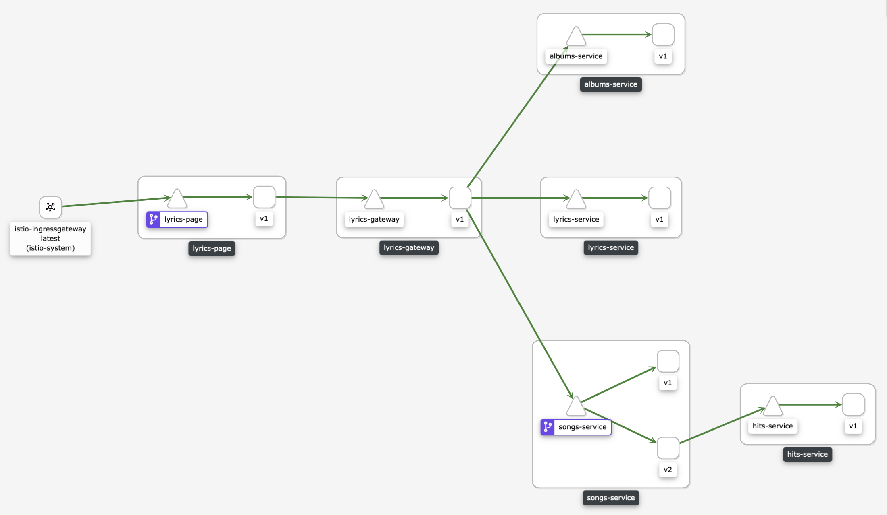

# Mimik

Simple application used to simulate being a microservice (or simulate many) in a chain. Helpful to test OpenShift Service Mesh (Istio) features.

Mimik can be instance many times with difference parameters thanks to an OpenShift template.

## Usage

### Template Parameters

* **APP_NAME**: Application name
* **APP_VERSION**: Application version
* **MIMIK_TYPE**: *passthrough* to continue the chain calling another service or *edge* to end it
* **MIMIK_DESTINATION**: The next service's URL to call to

## Demonstration

The goal is to deploy some mimik services to achieve the following topology:

**Note**: This demonstration assumes that Istio is already installed in **istio-system** namespace.

Create the following resources in an OpenShift cluster:

    oc create namespace musik

    oc process -f mimik-template.yaml -n musik \
        -p APP_NAME=page \
        -p APP_VERSION=v1 \
        -p MIMIK_TYPE=passthrough \
        -p MIMIK_DESTINATION=http://albums:5000/albums | oc apply -f - -n musik

    oc process -f mimik-template.yaml -n musik \
        -p APP_NAME=albums \
        -p APP_VERSION=v1 \
        -p MIMIK_TYPE=passthrough \
        -p MIMIK_DESTINATION=http://songs:5000/songs | oc apply -f - -n musik

    oc process -f mimik-template.yaml -n musik \
        -p APP_NAME=songs \
        -p APP_VERSION=v1 \
        -p MIMIK_TYPE=passthrough \
        -p MIMIK_DESTINATION=http://lyrics:5000/lyrics | oc apply -f - -n musik        

    oc process -f mimik-template.yaml -n musik \
        -p APP_NAME=songs \
        -p APP_VERSION=v2 \
        -p MIMIK_TYPE=passthrough \
        -p MIMIK_DESTINATION=http://lyrics:5000/lyrics | oc apply -f - -n musik                

    oc process -f mimik-template.yaml -n musik \
        -p APP_NAME=lyrics \
        -p APP_VERSION=v1 \
        -p MIMIK_TYPE=edge | oc apply -f - -n musik                

    oc apply -f istio.yaml

Then test the call to the first application (the page):

    curl $(oc get route musik -o jsonpath='{.spec.host}' -n istio-system)/page
    page ("v1") -> albums ("v1") -> songs ("v1") -> lyrics ("v1")    