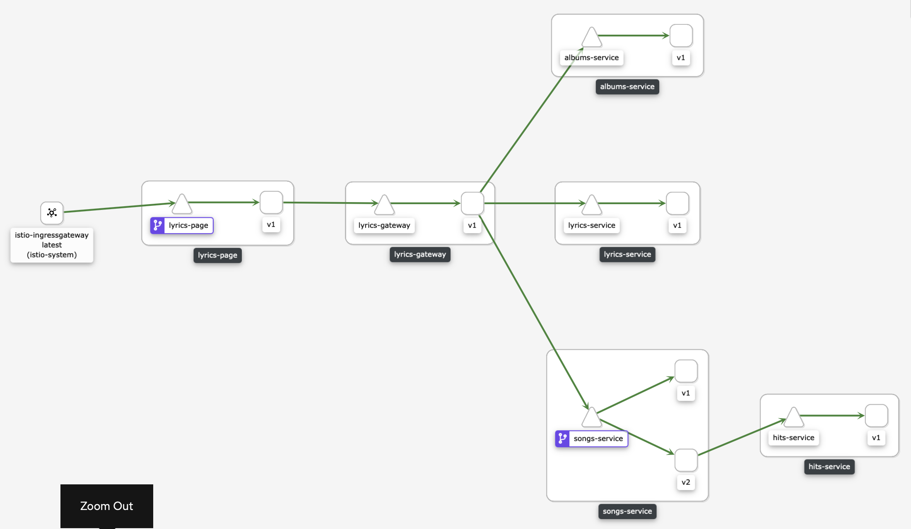

# Mimik

Simulate being a service (or many) in a mesh. 

Helpful to test Istio features like traffic routing, tracing, security and more. 

## Usage

Mimik can be instanced many times to create a mesh, each instance needs some configuration to listen for connections and to communicate with other instances.

The easiest way to deploy an instance is with a Helm chart, but before, a ConfigMap with the endpoints configuration needs to be created in the same namespace where the Mimik instance will be deployed. 

The following is a basic example:

```bash
echo '[
    {
        "name": "Hello World",
        "path": "/",
        "method": "GET",
        "connections": []
    }
]' > hello-world-v1.json

kubectl create namespace hello-world
kubectl create configmap hello-world-v1 --from-file=hello-world-v1.json -n hello-world

helm install hello-world-v1 ./chart --set version=v1 --set serviceName=hello-world -n hello-world
```

Note: The ConfigMap needs to be called serviceName-version by convention.

### Internals

Any Mimik instance needs to have the following configuration:

#### Environment Variables

The following environment variables are needed to create a Mimik instance manually (without the Helm chart):

| Variable | Description |
| - | - |
| MIMIK_SERVICE_NAME | The instance name |
| MIMIK_SERVICE_PORT | The instance port |
| MIMIK_ENDPOINTS_FILE | A file containing the endpoints configuration and the connections to upstream services |
| MIMIK_LABELS_FILE | A file containing labels, Mimik looks for the version label specifically in the file, if the file does not exists or does not have the version label it defaults to v1 |

#### Endpoints

The following file describes the endpoints that a Mimik instance listens for and the connections it has to other upstream services:

```json
[
    {
        "name": "Get songs",
        "path": "/",
        "method": "GET",
        "connections": [
            {
                "name": "songs-service",
                "port": "8080",
                "path": "songs",
                "method": "GET"
            }
        ]
    },
    {
        "name": "Get song with id 1",
        "path": "/songs/1",
        "method": "GET",
        "connections": [
            {
                "name": "songs-service",
                "port": "8080",
                "path": "songs/1",
                "method": "GET"
            },
            {
                "name": "hits-service",
                "port": "8080",
                "path": "hits/1",
                "method": "POST"
            }
        ]
    },
    {
        "name": "Health",
        "path": "/health",
        "method": "GET",
        "connections": []
    }
]
```

## Example

### Istio on Minikube Installation

```bash
minikube start --memory=8g --container-runtime=cri-o

istioctl install --set profile=demo --skip-confirmation

kubectl apply -f https://raw.githubusercontent.com/istio/istio/release-1.8/samples/addons/prometheus.yaml
kubectl apply -f https://raw.githubusercontent.com/istio/istio/release-1.8/samples/addons/grafana.yaml
kubectl apply -f https://raw.githubusercontent.com/istio/istio/release-1.8/samples/addons/kiali.yaml
kubectl apply -f https://raw.githubusercontent.com/istio/istio/release-1.8/samples/addons/jaeger.yaml

istioctl dashboard kiali
```

### Right Lyrics

The following commands will create a fake application called Right Lyrics, in terms of services it looks like:



#### Deployment

```bash
kubectl create namespace right-lyrics

kubectl label namespace right-lyrics istio-injection=enabled

kubectl create configmap lyrics-page-v1 --from-file=example/lyrics-page-v1.json -n right-lyrics
kubectl create configmap lyrics-gateway-v1 --from-file=example/lyrics-gateway-v1.json -n right-lyrics
kubectl create configmap lyrics-service-v1 --from-file=example/lyrics-service-v1.json -n right-lyrics
kubectl create configmap albums-service-v1 --from-file=example/albums-service-v1.json -n right-lyrics
kubectl create configmap songs-service-v1 --from-file=example/songs-service-v1.json -n right-lyrics
kubectl create configmap songs-service-v2 --from-file=example/songs-service-v2.json -n right-lyrics
kubectl create configmap hits-service-v1 --from-file=example/hits-service-v1.json -n right-lyrics

helm install lyrics-page-v1 ./chart --set version=v1 --set serviceName=lyrics-page -n right-lyrics
helm install lyrics-gateway-v1 ./chart --set version=v1 --set serviceName=lyrics-gateway -n right-lyrics
helm install lyrics-service-v1 ./chart --set version=v1 --set serviceName=lyrics-service -n right-lyrics
helm install albums-service-v1 ./chart --set version=v1 --set serviceName=albums-service -n right-lyrics
helm install songs-service-v1 ./chart --set version=v1 --set serviceName=songs-service -n right-lyrics
helm install songs-service-v2 ./chart --set version=v2 --set serviceName=songs-service --set createService=false -n right-lyrics
helm install hits-service-v1 ./chart --set version=v1 --set serviceName=hits-service -n right-lyrics

kubectl apply -f example/right-lyrics-gateway.yaml -n right-lyrics
```

#### Test

```bash
export INGRESS_PORT=$(kubectl -n istio-system get service istio-ingressgateway -o jsonpath='{.spec.ports[?(@.name=="http2")].nodePort}')
export INGRESS_HOST=$(minikube ip)
export GATEWAY_URL=$INGRESS_HOST:$INGRESS_PORT 

for i in {1..100}; do curl http://$GATEWAY_URL/songs/1; done
```