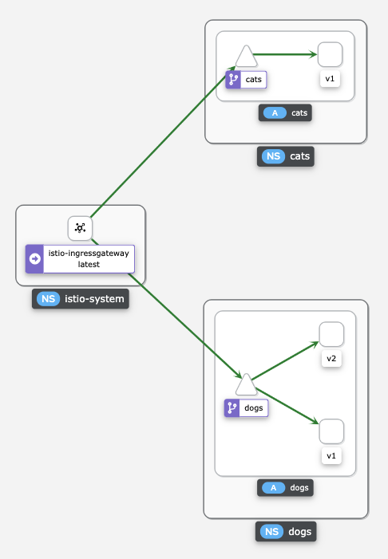

# Pets

The following is a demonstration on how to expose services from two different namespaces through a unique Istio gateway.

## Demo

Start a Minikube instance:

```
minikube start --memory=7962 --cpus=4 --driver=hyperkit
```

Install OLM:

```
curl -sL https://github.com/operator-framework/operator-lifecycle-manager/releases/download/v0.18.1/install.sh | bash -s v0.18.1
```

Install Istio (with Prometheus for metrics and Kiali for visualization):

```
istioctl install --set profile=demo

kubectl apply -f https://raw.githubusercontent.com/istio/istio/release-1.9/samples/addons/prometheus.yaml
kubectl apply -f https://raw.githubusercontent.com/istio/istio/release-1.9/samples/addons/kiali.yaml
```

Install Mimik:

```
echo "apiVersion: operators.coreos.com/v1alpha1
kind: CatalogSource
metadata:
  name: mimik-catalog
  namespace: olm
spec:
  sourceType: grpc
  image: quay.io/leandroberetta/mimik-operator-index:v0.0.1" | kubectl apply -f -

echo "apiVersion: operators.coreos.com/v1alpha1
kind: Subscription
metadata:
  name: mimik-subscription
  namespace: operators 
spec:
  channel: alpha
  installPlanApproval: Automatic
  name: mimik-operator
  source: mimik-catalog
  sourceNamespace: olm" | kubectl apply -f -
```

Create the namespaces for the applications:

```
kubectl create namespace cats
kubectl label namespace cats istio-injection=enabled

kubectl create namespace dogs
kubectl label namespace dogs istio-injection=enabled
```

Create the applications using Mimik:

### Cats

```
echo "apiVersion: mimik.veicot.io/v1alpha1
kind: Mimik
metadata:
  name: cats-v1
  namespace: cats
spec:
  service: cats
  version: v1
  endpoints:
    - path: /
      method: GET
      connections: []" | kubectl apply -f -
```

### Dogs

```
echo "apiVersion: mimik.veicot.io/v1alpha1
kind: Mimik
metadata:
  name: dogs-v1
  namespace: dogs
spec:
  service: dogs
  version: v1
  endpoints:
    - path: /
      method: GET
      connections: []" | kubectl apply -f -

echo "apiVersion: mimik.veicot.io/v1alpha1
kind: Mimik
metadata:
  name: dogs-v2
  namespace: dogs
spec:
  service: dogs
  version: v2
  endpoints:
    - path: /
      method: GET
      connections: []" | kubectl apply -f -
```

Create Istio routing resources:

```
kubectl apply -f pets.yaml
```

To test the applications, determine the ingress ip and port:

```
export INGRESS_PORT=$(kubectl -n istio-system get service istio-ingressgateway -o jsonpath='{.spec.ports[?(@.name=="http2")].nodePort}')
export INGRESS_HOST=$(minikube ip)
export GATEWAY_URL=$INGRESS_HOST:$INGRESS_PORT
```

Finally, execute:

```
curl http://$GATEWAY_URL/dogs
{"name":"dogs","version":"\"v1\"","path":"/","statusCode":200,"upstreamResponses":[]}

curl http://$GATEWAY_URL/dogs
{"name":"dogs","version":"\"v2\"","path":"/","statusCode":200,"upstreamResponses":[]}

curl http://$GATEWAY_URL/cats
{"name":"cats","version":"\"v1\"","path":"/","statusCode":200,"upstreamResponses":[]}
```

The following is the graph view generated by Kiali:

