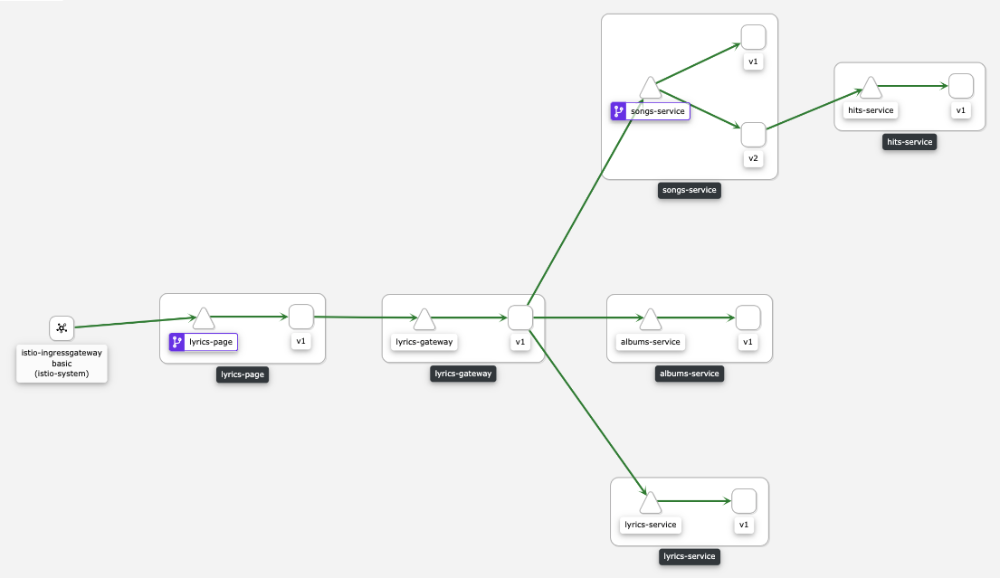

# Right Lyrics

The following is a fake application called Right Lyrics based on Mimik instances.

## Topology



## Deployment

Having the Mimik operator installed (see how to install it [here](https://github.com/leandroberetta/mimik-operator)).

```bash
oc create namespace right-lyrics

oc apply -f right-lyrics.yaml -n right-lyrics
```

Generate traffic and test the mesh:

```bash
for i in {1..100}; do curl $(oc get route istio-ingressgateway -o jsonpath='{.spec.host}' -n istio-system)/songs/1; done;
```